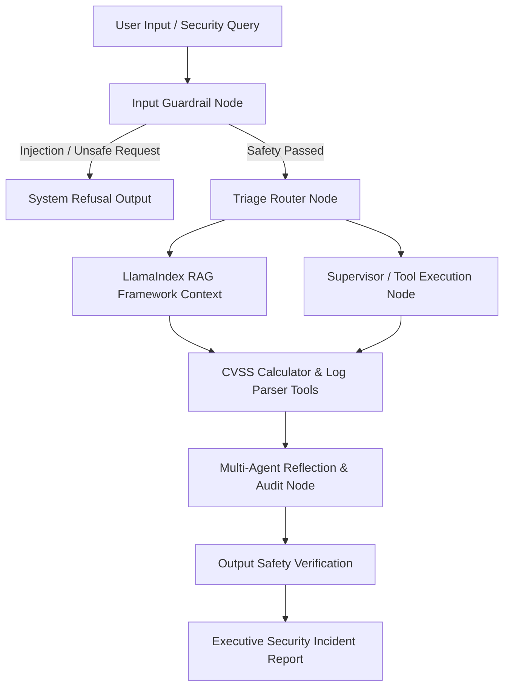

# 🛡️ SecCommander-Agent: Real-Time Security Incident Commander & Threat Triaging Agent
> **An Agentic AI System for Automated Threat Triaging, Vulnerability Risk Assessment, and Dual-Layer Guardrail Protection.**

---

## 📌 Executive Summary & Problem Statement
In modern Cybersecurity Operations Centers (SOC), security analysts face extreme **alert fatigue** from processing hundreds of daily system logs and vulnerability reports. Standard LLMs are insufficient for SOC operations due to halluncinations, lack of execution safety, and deterministic tool requirements.

**SecCommander-Agent** resolves this by automating the end-to-end triaging workflow. It dynamically routes security incidents, retrieves domain-specific standards via RAG, executes diagnostic tools, and enforces programmatic dual-layer guardrails to block prompt injections and dangerous payload generation.

---

##    System Architecture

🔑 Key Features & Multi-Agent Capabilities
Dual-Layer Guardrails (Input & Output Safety):

Input Level: Blocks direct and indirect Prompt Injections (e.g., Jailbreaks, Payload Smuggling) using dynamic pattern analysis.

Output Level: Verifies generated mitigation strategies to ensure no actionable exploit code or sensitive system info is exposed.

Semantic & Application-Layer Protection:

Detects complex attacks (SQLi, Logic Bypasses) that evade traditional network-layer WAFs and Rate Limiters.

Dynamic Triage Routing (LangGraph Orchestration):

Intelligently categorizes queries into RAG Retrieval, System Tool Execution, or Refusal paths.

Context-Aware RAG (LlamaIndex):

Grounded in official OWASP Top 10 and MITRE ATT&CK documentation for precise, hallucination-free advice.

Deterministic Security Tools Executions:

Automated CVSS v3.1 Scoring Calculator.

Automated Log Parsing & Incident Artifact Extraction.

Multi-Agent Reflection & Audit Loop:

Autonomous verification node that reviews generated triage reports for completeness and accuracy before presentation to analysts.

-- Tech Stack & Frameworks --
Core Framework: Python 3.10+

Agent Orchestration: LangGraph (State Graph Workflow)

Knowledge Retrieval: LlamaIndex

Security Knowledge Base: OWASP Standards & MITRE ATT&CK Framework
